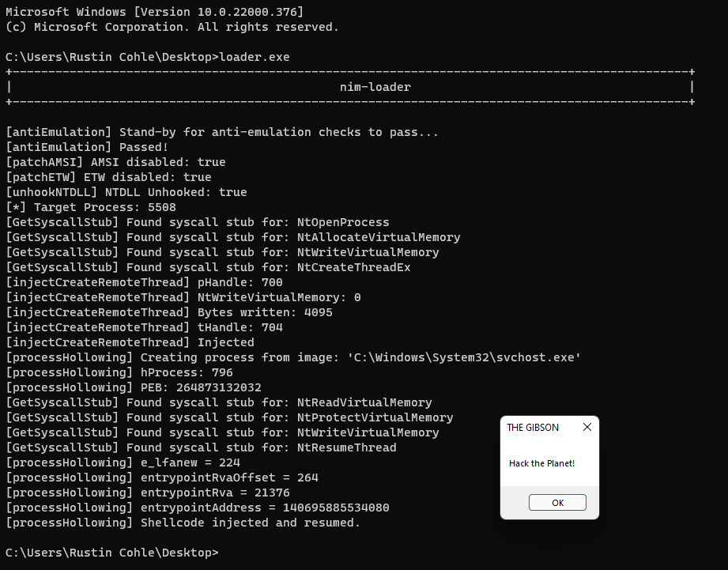

## nim-loader 

a work-in-progress adventure into learning nim by cobbling resources together to create 
a shellcode loader that implements common EDR/AV evasion techniques.

this code is very messy and will be updated as I learn more about evasion concepts and
the nim langague itself.

TO USE:
- Replace the byte array in `loader.nim` with your own x64 shellcode
- Compile the EXE and run it: `nim c -d:danger -d:strip --opt:size "loader.nim"`
- Probably adjust which process you want to inject into by looking in the .nim files of the injection folder method you're using...

TODO:
- Implement more injection methods
- Implement encryption on shellcode
- Implement a templating engine to automatically inject shellcode into the loader and compile the exe in multiple formats

References & Inspiration:
- OffensiveNim by Marcello Salvati (@byt3bl33d3r)
- NimlineWhispers2 by Alfie Champion (@ajpc500)
- SysWhispers3 by klezVirus (@KlezVirus)
- NimPackt-v1 by Cas van Cooten (@chvancooten)
- unhook_bof.c by Mr. Un1k0d3r (@MrUn1k0d3r)
- NimGetSyscallStub by S3cur3Th1sSh1t (@ShitSecure)

EXAMPLES:

    

